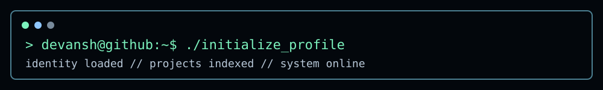
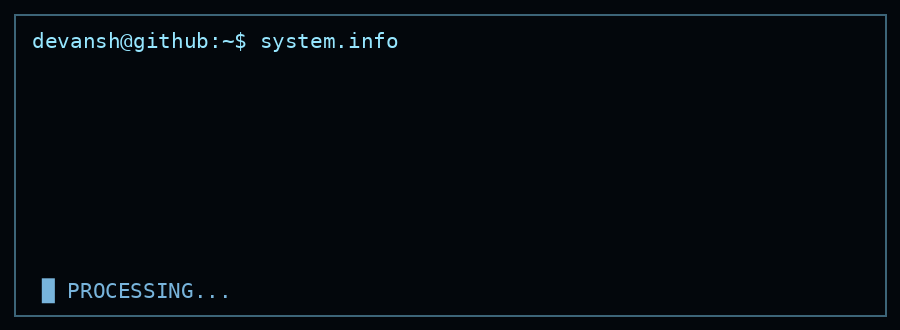
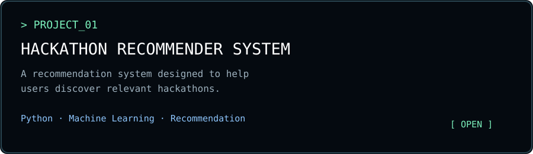
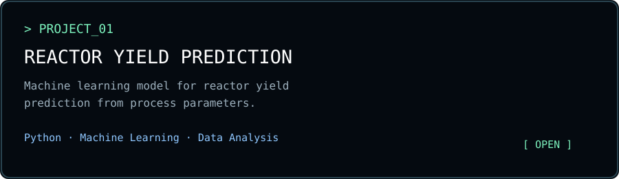

<div align="center">



<br>


<h1>DEVANSH ARVIND TRIPATHI</h1>

<p>
  <code>STUDENT</code> &nbsp; <code>DEVELOPER</code> &nbsp; <code>PROBLEM SOLVER</code>
</p>

</div>

---

<table>
<tr>
<td width="50%" valign="top">

### `$ whoami`

```text
Devansh Arvind Tripathi

student / developer

interested in:
  ├─ machine learning
  ├─ web development
  └─ problem solving
```

</td>
<td width="50%" valign="top">

### `$ system.info`



</td>
</tr>
</table>

---

## `$ cat tech_stack.txt`

```text
LANGUAGES
Python        ████████████████████
C++           ███████████████
JavaScript    ████████████
Java          ██████████

DEVELOPMENT
React         ████████████
HTML/CSS      █████████████
Git           ████████████████

INTERESTS
Machine Learning
Data / Problem Solving
```

---

## `$ ls ./projects`

<div align="center">

<a href="https://github.com/iamdcoder/Hackathon-Recommender">
  
</a>

<br><br>

<a href="https://github.com/iamdcoder/KineBurn---The-Yield-Predictor">
  
</a>

</div>

---

## `$ ./github_activity`

<div align="center">


</div>

---

## `$ ./contribution_matrix`

<div align="center">


</div>

---

## `$ ./terminal`

```text
devansh@github:~$ help

available commands
  whoami    →  display profile
  projects  →  list projects
  stack     →  show technologies
  activity  →  show GitHub activity
  contact   →  establish connection

devansh@github:~$ _
```

```text
$ git log --oneline

01  building new things
02  learning something new
03  breaking something
04  fixing it
05  repeating
```

<div align="center">

```text
$ exit

still building...
```

</div>