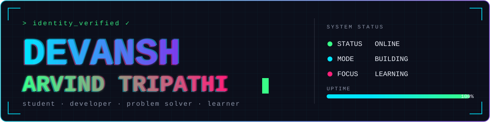
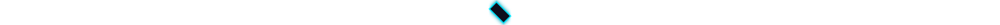
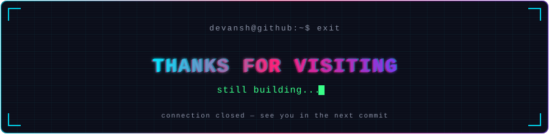

<div align="center">


<p align="center">
<a href="#about"></a>
<a href="#projects"></a>
<a href="#skills"></a>
<a href="#stats"></a>
<a href="#contact"></a>
</p>

<br>

<pre>
devansh@github:~$ ./initialize_profile

identity loaded
profile status: ONLINE

&gt; Welcome to my GitHub!

[✓] loading identity
[✓] rendering pixels
[✓] checking projects
[✓] establishing connection
[✓] system ready

devansh@github:~$ _
</pre>

<br>



<br><br>


<p><i>"Better questions, better answers — a slightly sharper version of me every commit."</i></p>
<p><sub>Working hard for a better future</sub></p>

</div>



<a id="about"></a>
## `$ whoami`

<div align="center">

<table>
<tr>

<td width="34%" valign="top">

<pre>&gt; about_me()</pre>

I'm a student who enjoys building things, exploring new ideas, and figuring out how stuff works. I'm interested in **Machine Learning**, **Web Development**, and solving real-world problems through code.

When I'm not on my laptop, you'll probably find me chasing a new idea down some rabbit hole.

Always learning. Always curious. 🚀

</td>

<td width="33%" valign="top">

<pre>&gt; quick_stats()</pre>

🎓&nbsp; Student  
`</>` &nbsp;Multiple Projects  
📊&nbsp; Focused on ML & Development  
📖&nbsp; Learning Something New Everyday  


</td>

<td width="33%" valign="top">

<pre>&gt; currently()</pre>

🟢&nbsp; Learning and building cool things  
🟢&nbsp; Exploring new opportunities  
🟢&nbsp; Open to collaborations  
🟢&nbsp; Trying to be a little better every day  

> _Same person. Same habit. A little more progress each day._

</td>

</tr>
</table>

</div>


<a id="skills"></a>
## `$ cat tech_stack.txt`

<div align="center">


<br>

<sub><b>Languages:</b> Python · C++ · JavaScript · Java &nbsp;|&nbsp; <b>Dev:</b> React · HTML/CSS · Git · VS Code</sub>

</div>


<a id="projects"></a>
## `$ ls ./projects`

<div align="center">

<table>
<tr>

<td width="50%" valign="top" align="center">

<pre>PROJECT_01</pre>

<a href="https://github.com/iamdcoder/Hackathon-Recommender">

</a>

<br>


</td>

<td width="60%" valign="top" align="center">

<pre>PROJECT_02</pre>

<a href="https://github.com/iamdcoder/KineBurn---The-Yield-Predictor">

</a>

<br>


<sub>🏆 3rd / 385 teams — IIT Kharagpur ChemE Hackathon</sub>

</td>

</tr>
</table>

<sub>More projects on <a href="https://github.com/iamdcoder?tab=repositories">→ view all repositories</a></sub>

</div>


<a id="stats"></a>
## `$ git log --graph` <sub><i># contributions</i></sub>

<div align="center">


<br>

</div>

### `$ git log --oneline`

```text
01  building new things
02  learning something new
03  breaking something
04  fixing it
05  repeating
```

### `$ ./terminal`

<div align="center">

<pre>
devansh@github:~$ help

AVAILABLE COMMANDS
────────────────────────────────────────────

whoami       →  display profile
projects     →  list projects
stack        →  show technologies
activity     →  show GitHub activity
contact      →  establish connection

────────────────────────────────────────────

devansh@github:~$ _
</pre>

</div>


<a id="contact"></a>
## `$ ./contact`

<div align="center">

<table>
<tr>

<td align="center" width="33%">

📫 <b>Email</b><br>
<sub>devansh.a.tripathi@gmail.com</sub>

</td>

<td align="center" width="33%">

💼 <b>LinkedIn</b><br>
<sub>linkedin.com/in/your-handle</sub>

</td>

<td align="center" width="33%">

🐙 <b>GitHub</b><br>
<sub><a href="https://github.com/iamdcoder">github.com/iamdcoder</a></sub>

</td>

</tr>
</table>

</div>

<div align="center">



</div>