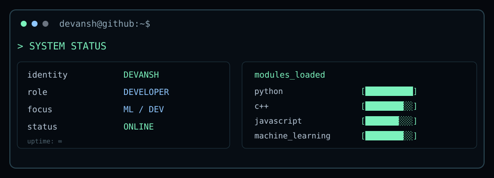

<div align="center">


<br>


<h1>DEVANSH ARVIND TRIPATHI</h1>

<p>
  <code>STUDENT</code> &nbsp; <code>DEVELOPER</code> &nbsp; <code>PROBLEM SOLVER</code>
</p>

</div>

---

<table>
<tr>
<td width="50%" valign="top">

### `$ whoami`

```text
Devansh Arvind Tripathi

student / developer

interested in:
  ├─ machine learning
  ├─ web development
  └─ problem solving
```

</td>
<td width="50%" valign="top">

### `$ system.info`


</td>
</tr>
</table>

---

## `$ cat tech_stack.txt`

```text
LANGUAGES
Python        ████████████████████
C++           ███████████████
JavaScript    ████████████
Java          ██████████

DEVELOPMENT
React         ████████████
HTML/CSS      █████████████
Git           ████████████████

INTERESTS
Machine Learning
Data / Problem Solving
```
---

## `$ ./projects`

<div align="center">

<table>
<tr>

<td width="50%">

<h3>Reactor Yield Prediction</h3>

<p>
Machine learning project for predicting reactor yield from process parameters.
</p>

<p>
<code>Python</code>
&nbsp;
<code>Machine Learning</code>
&nbsp;
<code>Data Analysis</code>
</p>

<a href="https://github.com/YOUR_USERNAME/YOUR_REACTOR_REPO">
View Repository →
</a>

</td>

<td width="50%">

<h3>KineBurn</h3>

<p>
A physics chemistry based surrogate to predict te yield of a product in a plug flow reactor
</p>

<p>
<code>Development</code>
&nbsp;
<code>UI</code>
&nbsp;
<code>Data</code>
</p>

<a href="https://github.com/YOUR_USERNAME/YOUR_KINEBURN_REPO">
View Repository →
</a>

</td>

</tr>
</table>

</div>

---

<div align="center">



</div>

---

## `$ ./github_activity`

<div align="center">


</div>

---

## `$ ./contribution_matrix`

<div align="center">


</div>


---

## `$ ls ./projects`

| Project | Description |
|---|---|
| **Reactor Yield Prediction** | Machine-learning project for predicting reactor yield from process parameters. |
| **KineBurn** | Fitness-focused project centered around workouts and calorie tracking. |

---

## `$ git log --oneline`

```text
01  building new things
02  learning something new
03  breaking something
04  fixing it
05  repeating
```

---

<div align="center">

### `$ exit`

`still building...`

</div>
